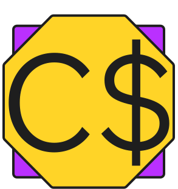

# 💰 Casher

**Casher** is a modern web application for managing and tracking personal finances.  
It allows users to record their income and expenses, categorize them, and analyze their financial habits through tables and visual charts.

This project was developed as a school assignment using the **Laravel framework**.

---

## Features

- User registration & authentication (Laravel Breeze)
- Add, edit, and delete transactions
- Overview of income, expenses, and total balance
- Categorization (food, rent, entertainment, transport, etc.)
- Filtering by date, category, and transaction type
- Data storage in a **MySQL** database
- Responsive UI with **Tailwind CSS**
- Secure authentication, CSRF protection, input validation

---

## Tech Stack

| Layer | Technology |
|--------|-------------|
| Backend | **Laravel 11 (PHP 8.3)** |
| Frontend | **Blade + Alpine.js + Tailwind CSS** |
| Authentication | **Laravel Breeze (Blade stack)** |
| Database | **MySQL 8.0** |
| Testing | **Pest / PHPUnit** |
| Local Dev | **Laravel Herd** |
| Version Control | **Git + GitHub** |

---

## Application Structure

| Module | Description |
|---------|--------------|
| **Dashboard** | Overview of total income, expenses, and balance |
| **Transactions** | Table of all transactions |
| **Add Transaction** | Form for creating new transactions |
| **Categories** | Category management |
| **Profile** | User profile & settings |
| **Auth** | Login, Register, Logout |

